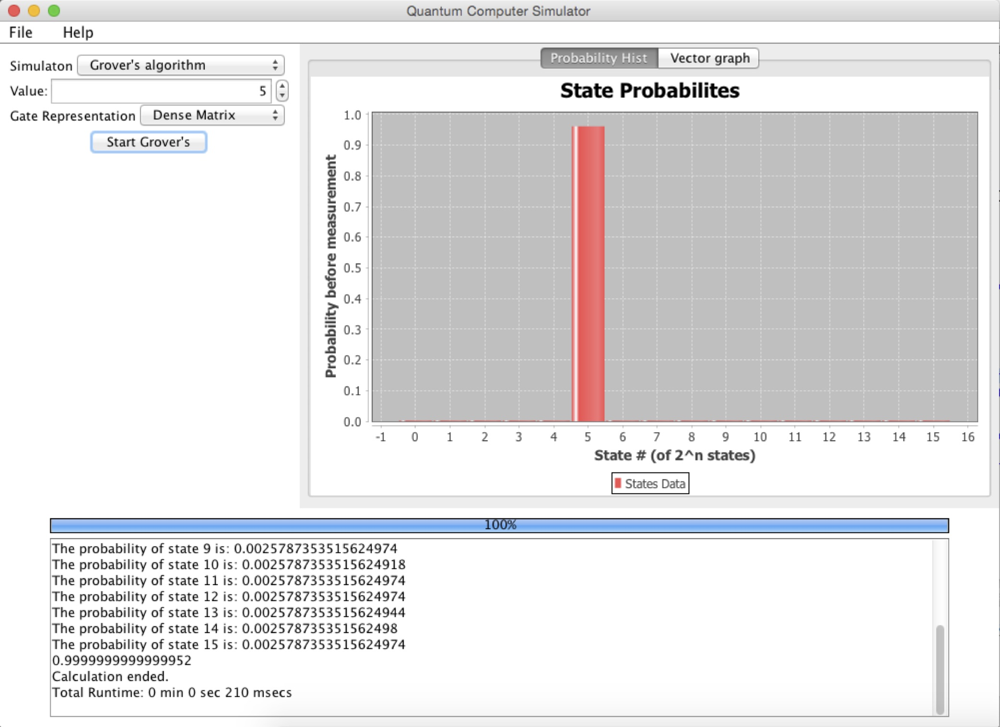

# Quantum Computing Project (Spring 2015)
A quantum computer emulator made by students at the University of Edinburgh.

by:
*  Michael Chiang
*  Gennaro Di Pietro
*  Wiliam Hunter McNichols
*  Christoph Messmer

# About
This report is an accumulation of knowledge and results from the course 'Quantum Computing Project' at the University of Edinburgh. In this project we simulated the physics of a quantum computer by modeling the interactions of qubits. On top of this simulator, we ran a handful of algorithms to experiment with the possibilities of a quantum computer. Lastly, to aid in experimentation we built a custom Graphical User Interface to interact with the underlying simulator code.

In addition, we experimented with a few different implementations for qubits and compared their performance. For a full report on our findings and an overview on the underlying mathematics see our report [here](https://github.com/wmcnicho/QCP_SP2015/blob/master/report/report_QCP2015.pdf).

## Running the program

From jar.: Run the .jar file `QCP_v2.jar` located in the root directory

From eclipse: Run the main program located in QuantumGuiFrame as a Java Application
(note: You may need to set import the JFreeChart .jar file to do this. See https://github.com/wmcnicho/QCP_SP2015/issues/11 for more information)

##  Basic Usage 

*   Use the drop down menu to the left to choose between running Shor's or Grover's algorithm.
*   Select the proper input value(s) for the simulation.
*   Select the desired gate representation
*   Press the start button

##  Grover's Algorithm

In order to start a Grover's simulation, import a txt file (via File->Open File) with comma separated numbers (i.e. 3,14,157,9,...) and a enter value to search for. Test data is provided in the 'tests/' directory.

##  Shor's Algorithm

To use Shor's input an integer between 2 to 1023 and it will be factorized.

Note: Shor's Algorithm will occasionally return obvious factors (i.e. the input number and  1) due to the inherent randomness of the algorithm. Run the simulation again if such results occur.

## Gate Representation

For best results use the 'Functional' gate representation. Sparse Matrix works slightly faster than Functional (and Dense Matrix) but can not run on as many qubits.

## JFreeChart
This program uses the JFreeChart open source library for it's graph outputs. See http://www.jfree.org/jfreechart/ for more information.
